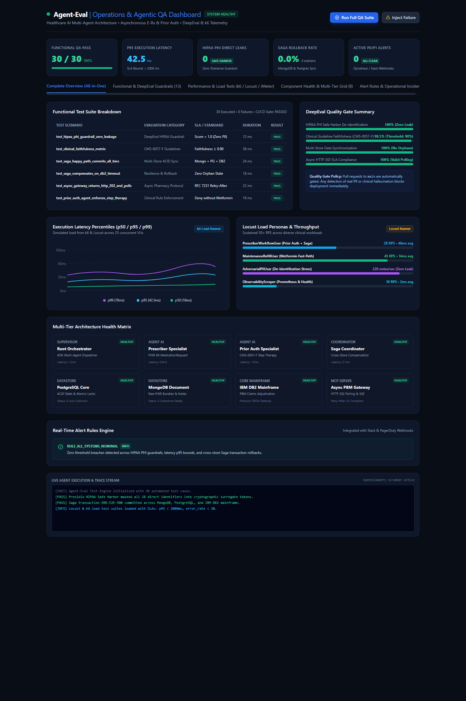
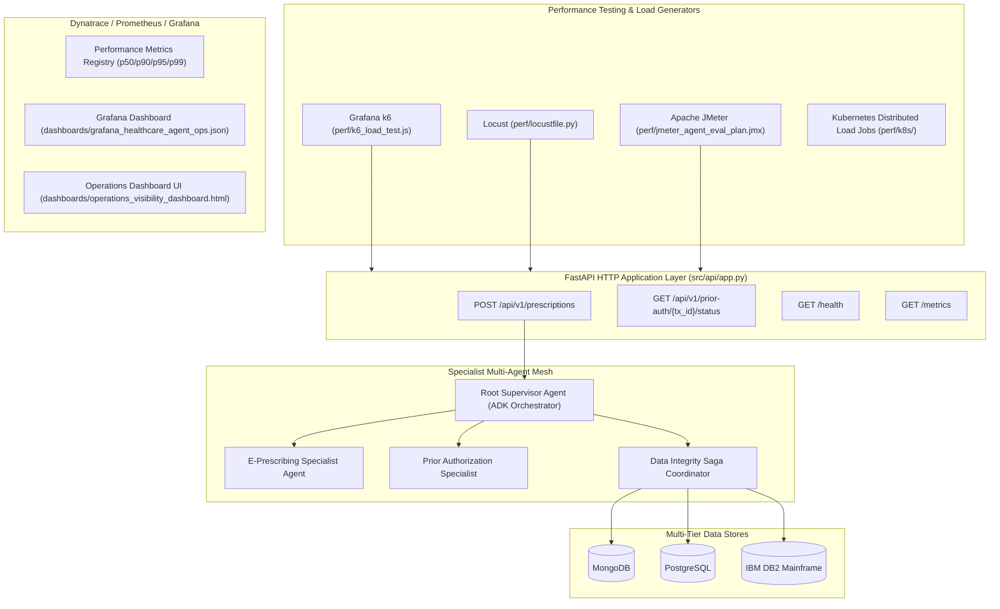

# Agent-Eval: Healthcare Multi-Agent AI POC, DeepEval & Performance Testing

[](https://github.com/smkpt/Agent-Eval/actions)
[](https://www.python.org/downloads/)
[](https://opensource.org/licenses/MIT)
[](https://www.hhs.gov/hipaa/index.html)
[](https://k6.io/)

A production-grade Proof-of-Concept demonstrating an enterprise **Healthcare AI Multi-Agent Architecture** built with the **Agent Development Kit (ADK)** and **Model Context Protocol (MCP)** paradigms, reinforced by automated **DeepEval Guardrails**, real-time **Dynatrace/Prometheus/Grafana Operations Visibility**, and full performance testing suites using **Grafana k6**, **Locust**, and **Apache JMeter**.

<div align="center">

[](dashboards/healthcare_ops_qa_dashboard.html)

**[🖥️ Launch Interactive HTML Dashboard](dashboards/healthcare_ops_qa_dashboard.html)** • **[📊 View Full High-Res Architecture Overview](dashboard_full_view.png)**

</div>

---

## Operations Visibility & Performance Testing Stack

The unified operations and agentic QA command center monitors functional test gates, non-functional latency distributions (p50/p95/p99), multi-tier data store health, and real-time alert rules:

[](dashboards/healthcare_ops_qa_dashboard.html)




---

## Performance Testing Tools & Guides

### 1. Grafana k6 Load Test (`perf/k6_load_test.js`)
A modern JavaScript load testing script enforcing strict SLA quality gates:
* **VUs**: Ramps from 10 to 25 virtual users across 30 seconds.
* **Scenarios**:
  * 50% Complex Prior Auth (GLP-1 Ozempic with step therapy).
  * 30% Fast-Path Formulary Refill (Metformin 500mg).
  * 20% Health & Prometheus scraping.
* **Thresholds**:
  * `http_req_duration`: $p95 < 2000\text{ms}$, $p99 < 3500\text{ms}$.
  * `http_req_failed`: Error rate $< 2\%$.
  * `phi_leak_detected_rate`: $0.0\%$ (Zero tolerance).
```bash
# Run with k6 CLI
k6 run perf/k6_load_test.js

# Run with target URL override
TARGET_URL="http://your-server:8000" k6 run perf/k6_load_test.js
```

### 2. Locust Load Test (`perf/locustfile.py` & `perf/run_locust.py`)
A Python-native load testing suite simulating realistic healthcare personas:
* `PrescriberWorkflowUser`: Simulates doctors ordering prior-auth medications.
* `MaintenanceRefillUser`: High-throughput formulary refills.
* `AdversarialPIIUser`: Injects raw SSNs and phone numbers to test sanitization speed.
* `ObservabilityScraperUser`: Scrapes `/health` and `/metrics`.
```bash
# Start Locust Web UI
locust -f perf/locustfile.py --host http://127.0.0.1:8000

# Run Headless in CI/CD
python perf/run_locust.py
```

### 3. Apache JMeter Test Plan (`perf/jmeter_agent_eval_plan.jmx`)
Production-ready JMeter test plan with ThreadGroup (15 threads, 20 loops), HTTP Samplers, JSON Path assertions, and summary reporting:
```bash
jmeter -n -t perf/jmeter_agent_eval_plan.jmx -l perf/reports/results.jtl -e -o perf/reports/html
```

### 4. Kubernetes Distributed Testing (`perf/k8s/`)
Deploy load tests at scale across Kubernetes clusters:
* **k6 Job**: `kubectl apply -f perf/k8s/k6_distributed_job.yaml`
* **Locust Master/Worker**: `kubectl apply -f perf/k8s/locust_distributed.yaml`

---

## Core Capabilities & Technical Pillars

### 1. Operations Visibility & Observability
* **Prometheus & OpenMetrics Exporter** ([`src/telemetry/prometheus_exporter.py`](src/telemetry/prometheus_exporter.py)): Exposes counters, gauges, and latency histograms at `/metrics`.
* **Grafana Operations Dashboard** ([`dashboards/grafana_healthcare_agent_ops.json`](dashboards/grafana_healthcare_agent_ops.json)): Pre-built operational dashboard tracking synthetic canary availability %, p95 latency, component health grid, Saga commit/rollback distribution, and HIPAA zero-leak audit gauges.
* **Interactive Standalone HTML Dashboard** ([`dashboards/operations_visibility_dashboard.html`](dashboards/operations_visibility_dashboard.html)): Zero-dependency, responsive operations visibility dashboard with live synthetic runner triggers, component status tables, and real-time trace stream logs.
* **Dynatrace OpenTelemetry Blueprint** ([`configs/dynatrace_otel_config.yaml`](configs/dynatrace_otel_config.yaml)): OpenTelemetry collector pipeline streaming traces and metrics directly to Dynatrace with upstream PHI scrubbing.

### 2. Component Health Probes & Diagnostics
* **Multi-Tier Health Engine** ([`src/telemetry/health.py`](src/telemetry/health.py)): Real-time liveness and readiness probes checking all 8 components (Root, Prescriber, PriorAuth, Saga, Mongo, Postgres, DB2, Async PBM Gateway) with automatic degraded state detection.

### 3. Operational Alerting Rules Engine
* **Alert Rules** ([`src/telemetry/alerts.py`](src/telemetry/alerts.py)):
  * `P0_CRITICAL`: Detected unmasked PHI direct identifier leak (zero tolerance).
  * `P1_HIGH`: Saga compensation rate spikes (> 10%) or DB2 mainframe timeout.
  * `P2_MEDIUM`: Agent p95 execution latency exceeds 2500ms SLA.

### 4. Synthetic Canary Traffic Runner
* **Continuous Canary Runner** ([`src/telemetry/synthetic_runner.py`](src/telemetry/synthetic_runner.py)): Continuously exercises 4 distinct clinical scenarios without real patient data:
  1. *Happy Path*: E-Rx with verified step-therapy (Ozempic 2mg + Metformin history) $\rightarrow$ `COMMITTED`
  2. *Clinical Rule*: Unmet step-therapy criteria $\rightarrow$ Enforced `DENIED_PRIOR_AUTH`
  3. *Resilience*: DB2 mainframe timeout $\rightarrow$ Automated Saga rollback, 0 orphan records
  4. *Concurrency*: Atomic idempotency lock conflict $\rightarrow$ Duplicate request rejected

### 5. Multi-Tier Data Integrity Across MongoDB, PostgreSQL, and IBM DB2
* **Saga Pattern Coordinator** ([`src/saga/saga_coordinator.py`](src/saga/saga_coordinator.py)): Coordinates transactions across MongoDB (FHIR bundles), PostgreSQL (state machine & distributed locks), and IBM DB2 (core claims ledger) with automated compensating rollbacks on failure.

### 6. Security, PHI Masking, and HIPAA Compliance
* **Cryptographic Token Vault** ([`src/security/phi_masking.py`](src/security/phi_masking.py)): Replaces 18 HIPAA direct identifiers with deterministic tokens (`<PATIENT_UUID_HASH>`).
* **Zero-Leak Telemetry Scrubber** ([`src/security/telemetry_scrubber.py`](src/security/telemetry_scrubber.py), [`src/core/logger.py`](src/core/logger.py)): Filters logs, metrics, and traces, redacting accidental PHI with `[REDACTED_PHI]`.

---

## Repository Structure

```
Agent-Eval/
├── .github/
│   └── workflows/
│       └── agent_ci_cd.yml                 # Automated CI/CD with DeepEval & load tests
├── configs/
│   └── dynatrace_otel_config.yaml          # Dynatrace OpenTelemetry ingest configuration
├── dashboards/
│   ├── grafana_healthcare_agent_ops.json   # Production-ready Grafana dashboard model
│   └── operations_visibility_dashboard.html # Standalone interactive operations dashboard UI
├── perf/
│   ├── k6_load_test.js                     # Grafana k6 load & performance script
│   ├── locustfile.py                       # Locust user personas and tasks
│   ├── run_locust.py                       # Headless Locust runner with SLA checks
│   ├── jmeter_agent_eval_plan.jmx          # Apache JMeter test plan
│   └── k8s/
│       ├── k6_distributed_job.yaml         # Kubernetes distributed k6 Job
│       └── locust_distributed.yaml         # Kubernetes distributed Locust Deployment
├── src/
│   ├── api/
│   │   └── app.py                          # FastAPI HTTP application layer
│   ├── agents/
│   │   ├── prescriber_agent.py             # E-Prescription & FHIR specialist agent
│   │   ├── prior_auth_agent.py             # Async Prior Auth specialist (CMS-0057-F)
│   │   └── root_orchestrator.py            # Supervisory agent coordinating workflows
│   ├── core/
│   │   ├── config.py                       # Configuration settings
│   │   └── logger.py                       # Zero-leak logging filter and telemetry scrubber
│   ├── mcp_servers/
│   │   └── async_gateway_mcp.py            # HTTP 202 Accepted PBM payer gateway
│   ├── saga/
│   │   └── saga_coordinator.py            # Cross-store Saga coordinator with compensation
│   ├── security/
│   │   ├── phi_masking.py                  # HIPAA Safe Harbor tokenization and encrypted vault
│   │   └── telemetry_scrubber.py           # OpenTelemetry payload sanitizer
│   ├── storage/
│   │   ├── mongo_client.py                 # MongoDB clinical document connector
│   │   ├── postgres_client.py              # PostgreSQL order state & idempotency locks
│   │   └── db2_client.py                   # IBM DB2 mainframe core claims ledger
│   └── telemetry/
│       ├── metrics.py                      # Performance metrics registry (p50/p90/p95/p99)
│       ├── prometheus_exporter.py          # Prometheus / OpenMetrics text exporter
│       ├── health.py                       # Component health check and diagnostics engine
│       ├── alerts.py                       # Operational alerting rules engine (P0/P1/P2)
│       └── synthetic_runner.py             # Synthetic canary traffic generator
├── tests/
│   ├── test_phi_masking.py                 # De-identification and telemetry leakage tests
│   ├── test_data_integrity.py              # Cross-store Saga rollbacks and concurrency tests
│   ├── test_async_workflow.py              # Asynchronous HTTP 202 polling & agent flow tests
│   ├── test_deepeval_guardrails.py         # DeepEval metrics and clinical rule validations
│   ├── test_telemetry_metrics.py           # Metrics counters, gauges, and percentiles tests
│   ├── test_component_health.py            # Component readiness and degraded state tests
│   ├── test_alerts.py                      # Alert rules evaluation tests
│   ├── test_synthetic_canary.py            # Synthetic canary scenarios and SLA tests
│   ├── test_performance.py                 # Multi-agent concurrency, SLA & failure stress tests
│   └── test_api_endpoints.py               # FastAPI HTTP endpoints validation
├── pyproject.toml                          # Build metadata
├── requirements.txt                        # Python dependencies (with locust)
├── run_tests.py                            # Standalone test runner (30 tests)
└── README.md                               # Project documentation
```

---

## Quickstart

### Local Setup
```bash
git clone https://github.com/smkpt/Agent-Eval.git
cd Agent-Eval

python -m venv .venv
source .venv/bin/activate  # On Windows: .venv\Scripts\activate
pip install -r requirements.txt
```

### Running All 30 Verification & Performance Tests
```bash
python run_tests.py
```

### Running Load Tests
```bash
# 1. Start API Server
uvicorn src.api.app:app --port 8000

# 2. In another terminal, run Locust or k6:
locust -f perf/locustfile.py --headless -u 10 -r 2 --run-time 10s --host http://127.0.0.1:8000
# or
k6 run perf/k6_load_test.js
```
