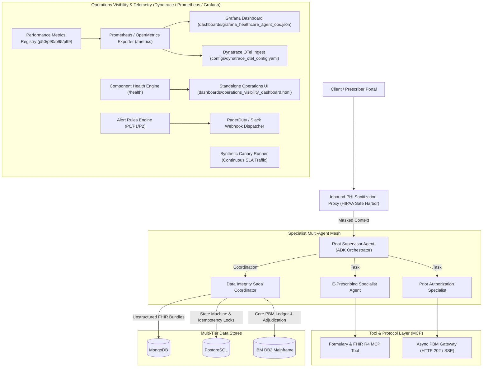

# Agent-Eval: Healthcare Multi-Agent AI POC, DeepEval & Operations Visibility

[](https://github.com/smkpt/Agent-Eval/actions)
[](https://www.python.org/downloads/)
[](https://opensource.org/licenses/MIT)
[](https://www.hhs.gov/hipaa/index.html)
[](https://prometheus.io/)

A production-grade Proof-of-Concept demonstrating an enterprise **Healthcare AI Multi-Agent Architecture** built with the **Agent Development Kit (ADK)** and **Model Context Protocol (MCP)** paradigms, reinforced by automated **DeepEval Guardrails**, real-time **Dynatrace/Prometheus/Grafana Operations Visibility**, and full **CI/CD Quality Gates**.

---

## Operations Visibility & Synthetic Monitoring




---

## Core Capabilities & Technical Pillars

### 1. Operations Visibility & Observability
* **Prometheus & OpenMetrics Exporter** ([`src/telemetry/prometheus_exporter.py`](src/telemetry/prometheus_exporter.py)): Exposes counters, gauges, and latency histograms formatted for Prometheus, Datadog, or Dynatrace scraping.
* **Grafana Operations Dashboard** ([`dashboards/grafana_healthcare_agent_ops.json`](dashboards/grafana_healthcare_agent_ops.json)): Pre-built operational dashboard tracking synthetic canary availability %, p95 latency, component health grid, Saga transaction distribution, and HIPAA zero-leak audit gauges.
* **Interactive Standalone HTML Dashboard** ([`dashboards/operations_visibility_dashboard.html`](dashboards/operations_visibility_dashboard.html)): Zero-dependency, responsive operations visibility dashboard with live synthetic runner triggers, component status tables, and real-time trace stream logs.
* **Dynatrace OpenTelemetry Blueprint** ([`configs/dynatrace_otel_config.yaml`](configs/dynatrace_otel_config.yaml)): OpenTelemetry collector pipeline streaming traces and metrics directly to Dynatrace with upstream PHI scrubbing.

### 2. Component Health Probes & Diagnostics
* **Multi-Tier Health Engine** ([`src/telemetry/health.py`](src/telemetry/health.py)): Real-time liveness and readiness probes checking:
  * `RootHealthcareOrchestrator`
  * `PrescriberAgent`
  * `PriorAuthAgent`
  * `SagaCoordinator`
  * `PostgresClient`
  * `MongoClient`
  * `DB2Client`
  * `AsyncPayerGatewayMCP`
* Diagnoses and isolates degraded states (e.g. simulated DRDA protocol timeouts on the DB2 core ledger).

### 3. Operational Alerting Rules Engine
* **Alert Rules** ([`src/telemetry/alerts.py`](src/telemetry/alerts.py)):
  * `P0_CRITICAL`: Detected unmasked PHI direct identifier leak (zero tolerance).
  * `P1_HIGH`: Saga compensation rate spikes (> 10%) or DB2 mainframe timeout.
  * `P2_MEDIUM`: Agent p95 execution latency exceeds 2500ms SLA.

### 4. Synthetic Canary Traffic Runner
* **Continuous Canary Runner** ([`src/telemetry/synthetic_runner.py`](src/telemetry/synthetic_runner.py)): Exercises 4 distinct clinical scenarios without real patient data:
  1. *Happy Path*: E-Rx with verified step-therapy (Ozempic 2mg + Metformin history) $\rightarrow$ `COMMITTED`
  2. *Clinical Rule*: Unmet step-therapy criteria $\rightarrow$ Enforced `DENIED_PRIOR_AUTH`
  3. *Resilience*: DB2 mainframe timeout $\rightarrow$ Automated Saga rollback, 0 orphan records
  4. *Concurrency*: Atomic idempotency lock conflict $\rightarrow$ Duplicate request rejected

### 5. Asynchronous Pharmacy & Prescriber Workflows
* **RFC 7231 HTTP 202 Accepted Pattern**: Complex prior authorizations and claims return asynchronous polling headers (`Location`, `Retry-After: 2`) rather than holding open blocking HTTP sockets.
* **CMS-0057-F Compliance**: Specialist agents enforce step-therapy criteria before approving GLP-1 or specialty medications.

### 6. Data Integrity Across MongoDB, PostgreSQL, and IBM DB2
* **Saga Pattern Coordinator** ([`src/saga/saga_coordinator.py`](src/saga/saga_coordinator.py)): Coordinates transactions across MongoDB (FHIR bundles), PostgreSQL (state machine & distributed locks), and IBM DB2 (core claims ledger) with automated compensating rollbacks on failure.

### 7. Security, PHI Masking, and HIPAA Compliance
* **Cryptographic Token Vault** ([`src/security/phi_masking.py`](src/security/phi_masking.py)): Replaces 18 HIPAA direct identifiers with deterministic tokens (`<PATIENT_UUID_HASH>`).
* **Zero-Leak Telemetry Scrubber** ([`src/security/telemetry_scrubber.py`](src/security/telemetry_scrubber.py), [`src/core/logger.py`](src/core/logger.py)): Filters logs, metrics, and traces, redacting accidental PHI with `[REDACTED_PHI]`.

---

## Repository Structure

```
Agent-Eval/
├── .github/
│   └── workflows/
│       └── agent_ci_cd.yml                 # Automated CI/CD with DeepEval & telemetry gates
├── configs/
│   └── dynatrace_otel_config.yaml          # Dynatrace OpenTelemetry ingest configuration
├── dashboards/
│   ├── grafana_healthcare_agent_ops.json   # Production-ready Grafana dashboard model
│   └── operations_visibility_dashboard.html # Standalone interactive operations dashboard UI
├── src/
│   ├── agents/
│   │   ├── prescriber_agent.py             # E-Prescription & FHIR specialist agent
│   │   ├── prior_auth_agent.py             # Async Prior Auth specialist (CMS-0057-F)
│   │   └── root_orchestrator.py            # Supervisory agent coordinating workflows
│   ├── core/
│   │   ├── config.py                       # Configuration settings
│   │   └── logger.py                       # Zero-leak logging filter and telemetry scrubber
│   ├── mcp_servers/
│   │   └── async_gateway_mcp.py            # HTTP 202 Accepted PBM payer gateway
│   ├── saga/
│   │   └── saga_coordinator.py            # Cross-store Saga coordinator with compensation
│   ├── security/
│   │   ├── phi_masking.py                  # HIPAA Safe Harbor tokenization and encrypted vault
│   │   └── telemetry_scrubber.py           # OpenTelemetry payload sanitizer
│   ├── storage/
│   │   ├── mongo_client.py                 # MongoDB clinical document connector
│   │   ├── postgres_client.py              # PostgreSQL order state & idempotency locks
│   │   └── db2_client.py                   # IBM DB2 mainframe core claims ledger
│   └── telemetry/
│       ├── metrics.py                      # Performance metrics registry (p50/p90/p95/p99)
│       ├── prometheus_exporter.py          # Prometheus / OpenMetrics text exporter
│       ├── health.py                       # Component health check and diagnostics engine
│       ├── alerts.py                       # Operational alerting rules engine (P0/P1/P2)
│       └── synthetic_runner.py             # Synthetic canary traffic generator
├── tests/
│   ├── test_phi_masking.py                 # De-identification and telemetry leakage tests
│   ├── test_data_integrity.py              # Cross-store Saga rollbacks and concurrency tests
│   ├── test_async_workflow.py              # Asynchronous HTTP 202 polling & agent flow tests
│   ├── test_deepeval_guardrails.py         # DeepEval metrics and clinical rule validations
│   ├── test_telemetry_metrics.py           # Metrics counters, gauges, and percentiles tests
│   ├── test_component_health.py            # Component readiness and degraded state tests
│   ├── test_alerts.py                      # Alert rules evaluation tests
│   └── test_synthetic_canary.py            # Synthetic canary scenarios and SLA tests
├── pyproject.toml                          # Build metadata
├── requirements.txt                        # Python dependencies
├── run_tests.py                            # Standalone test runner (22 tests)
└── README.md                               # Project documentation
```

---

## Quickstart

### Local Setup
```bash
git clone https://github.com/smkpt/Agent-Eval.git
cd Agent-Eval

python -m venv .venv
source .venv/bin/activate  # On Windows: .venv\Scripts\activate
pip install -r requirements.txt
```

### Running All 22 Verification Tests
```bash
python run_tests.py
```

### Viewing the Operations Visibility Dashboard
Open `dashboards/operations_visibility_dashboard.html` in any web browser to view the real-time operations dashboard, health grid, and trigger live synthetic canary batches.

---

## Continuous Integration (CI/CD)

The GitHub Actions pipeline (`.github/workflows/agent_ci_cd.yml`) automatically executes on every push and PR:
1. **Security & PHI Verification**: Validates tokenization and zero telemetry leakage.
2. **Multi-Tier Saga Rollbacks**: Simulates DB2 mainframe outages and asserts 0 orphan records.
3. **Asynchronous SLA Tests**: Validates RFC 7231 HTTP 202 retry headers and status transitions.
4. **DeepEval Guardrail Gates**: Evaluates clinical faithfulness and HIPAA zero-tolerance metrics.
5. **Telemetry & Metrics Verification**: Validates latency percentiles, Prometheus format, and health probes.
6. **Synthetic Canary Execution**: Executes canary runs and enforces availability SLA.
