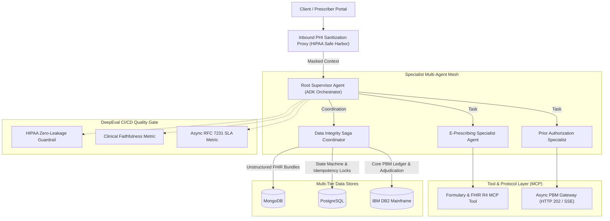

# Agent-Eval: Healthcare Multi-Agent AI POC & DeepEval Guardrails

[](https://github.com/smkpt/Agent-Eval/actions)
[](https://www.python.org/downloads/)
[](https://opensource.org/licenses/MIT)
[](https://www.hhs.gov/hipaa/index.html)

A production-grade Proof-of-Concept demonstrating an enterprise **Healthcare AI Multi-Agent Architecture** built with the **Agent Development Kit (ADK)** and **Model Context Protocol (MCP)** paradigms, reinforced by automated **DeepEval Guardrails** and full **CI/CD Quality Gates**.

---

## Architecture Overview



---

## Key Pillars & Technical Capabilities

### 1. Asynchronous Pharmacy & Prescriber Workflows
* **RFC 7231 HTTP 202 Accepted Pattern**: Complex prior authorizations and real-time benefit checks (RTBC) return an asynchronous response containing `Location` and `Retry-After` headers rather than blocking the agent thread.
* **Clinical Step-Therapy Evaluation**: Specialist agents automatically verify clinical prerequisites (e.g. Type 2 Diabetes diagnosis and documented first-line Metformin trial before approving GLP-1 medications like Ozempic or Trulicity under **CMS-0057-F** rules).

### 2. Multi-Tier Data Integrity Across MongoDB, PostgreSQL, and IBM DB2
* **Heterogeneous Datastores**:
  * **MongoDB**: Stores raw clinical SOAP notes and FHIR R4 JSON bundles.
  * **PostgreSQL**: Operates ACID order state transitions (`DRAFT` $\rightarrow$ `COMMITTED` / `ROLLED_BACK`) and distributed atomic idempotency locks to avoid race conditions.
  * **IBM DB2**: Interfaces with legacy PBM mainframe billing ledgers and copay balances.
* **Orchestration-Based Saga Pattern**: In the event of a downstream DB2 timeout or credit exhaustion, automated compensating transactions reverse all mutations in Postgres and Mongo, guaranteeing **zero orphan state**.

### 3. Security, PHI Masking, and HIPAA Compliance
* **Cryptographic Token Vault**: Inbound prompts strip all 18 HIPAA Safe Harbor direct identifiers (Names, SSN, MRN, Phone, Email, DOB) and substitute deterministic tokens (e.g. `<PATIENT_UUID_HASH>`).
* **Zero-Leak Telemetry & Logging Scrubber**: Automated log scrubbers intercept all OpenTelemetry spans, metrics, and standard output streams, redacting potential PII/PHI with `[REDACTED_PHI]`.

### 4. DeepEval Guardrail & Validation Suite
* **HIPAA PII Guardrail**: Enforces a strict score of `1.0` (zero tolerance) on test outputs.
* **Clinical Faithfulness**: Validates agent explanations against standard payer medical policies.
* **Asynchronous SLA Validation**: Verifies backoff timing and retry behavior against service level objectives.

---

## Repository Structure

```
Agent-Eval/
├── .github/
│   └── workflows/
│       └── agent_ci_cd.yml           # Automated CI/CD pipeline with DeepEval quality gates
├── src/
│   ├── agents/
│   │   ├── prescriber_agent.py       # E-Prescription & FHIR specialist agent
│   │   ├── prior_auth_agent.py       # Async Prior Auth specialist (CMS-0057-F)
│   │   └── root_orchestrator.py      # Supervisory agent coordinating workflows
│   ├── core/
│   │   ├── config.py                 # Core settings and environment configurations
│   │   └── logger.py                 # Zero-leak logging filter and telemetry scrubber
│   ├── mcp_servers/
│   │   └── async_gateway_mcp.py      # HTTP 202 Accepted PBM payer gateway
│   ├── saga/
│   │   └── saga_coordinator.py      # Cross-store Saga coordinator with compensation
│   ├── security/
│   │   ├── phi_masking.py            # HIPAA Safe Harbor tokenization and encrypted vault
│   │   └── telemetry_scrubber.py     # OpenTelemetry payload sanitizer
│   └── storage/
│       ├── mongo_client.py           # MongoDB clinical document connector
│       ├── postgres_client.py        # PostgreSQL order state & idempotency locks
│       └── db2_client.py             # IBM DB2 mainframe core claims ledger
├── tests/
│   ├── test_phi_masking.py           # De-identification and telemetry leakage tests
│   ├── test_data_integrity.py        # Cross-store Saga rollbacks and concurrency tests
│   ├── test_async_workflow.py        # Asynchronous HTTP 202 polling & agent flow tests
│   └── test_deepeval_guardrails.py   # DeepEval metrics and clinical rule validations
├── pyproject.toml                    # Build metadata
├── requirements.txt                  # Python dependencies
├── run_tests.py                      # Standalone test runner
└── README.md                         # Project documentation
```

---

## Quickstart

### Prerequisites
* Python 3.10 or higher
* Git

### Local Setup
```bash
# Clone the repository
git clone https://github.com/smkpt/Agent-Eval.git
cd Agent-Eval

# Create and activate virtual environment
python -m venv .venv
source .venv/bin/activate  # On Windows: .venv\Scripts\activate

# Install dependencies
pip install -r requirements.txt
```

### Running Tests and Guardrails

Run all tests via pytest:
```bash
pytest tests/ -v
```

Or execute the universal test runner:
```bash
python run_tests.py
```

Expected output:
```
======================================================================
  RUNNING HEALTHCARE AGENT & DEEPEVAL GUARDRAIL SUITE
======================================================================
  [PASS] test_phi_masking_identifiers
  [PASS] test_telemetry_scrubber_dictionary
  [PASS] test_logger_filter_prevents_leaks
  [PASS] test_saga_happy_path_commits_all_tiers
  [PASS] test_saga_compensates_on_db2_timeout
  [PASS] test_idempotency_prevents_duplicate_race_condition
  [PASS] test_async_gateway_returns_http_202_and_polls
  [PASS] test_prior_auth_agent_enforces_step_therapy
  [PASS] test_root_orchestrator_end_to_end_sanitization_and_commit
  [PASS] test_hipaa_phi_guardrail_zero_leakage
  [PASS] test_hipaa_phi_guardrail_catches_leak
  [PASS] test_clinical_faithfulness_metric
  [PASS] test_async_workflow_sla_metric
======================================================================
RESULTS: 13 PASSED, 0 FAILED
======================================================================
```

---

## Continuous Integration (CI/CD)

The GitHub Actions pipeline (`.github/workflows/agent_ci_cd.yml`) automatically runs on every push and pull request to `main` and `master`:
1. **Dependency Installation**: Caches and installs `pytest` and `deepeval`.
2. **Security & PHI Verification**: Validates tokenization and ensures zero unmasked leakage.
3. **Multi-Tier Saga Rollback Verification**: Simulates mainframe timeouts and confirms clean state rollbacks.
4. **Asynchronous SLA Tests**: Validates RFC 7231 HTTP 202 compliance.
5. **DeepEval Guardrail Gates**: Evaluates clinical faithfulness and HIPAA thresholds, blocking pull requests that fail validation.
